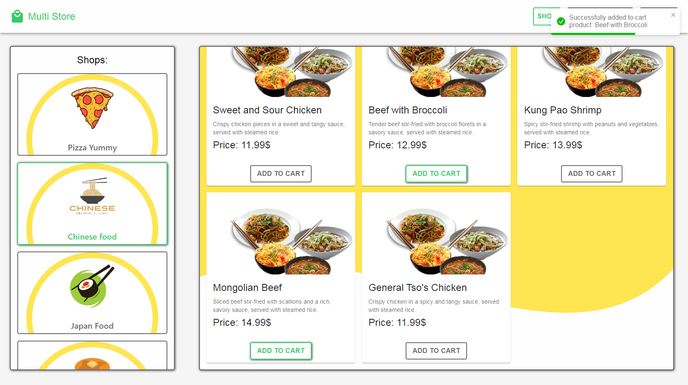
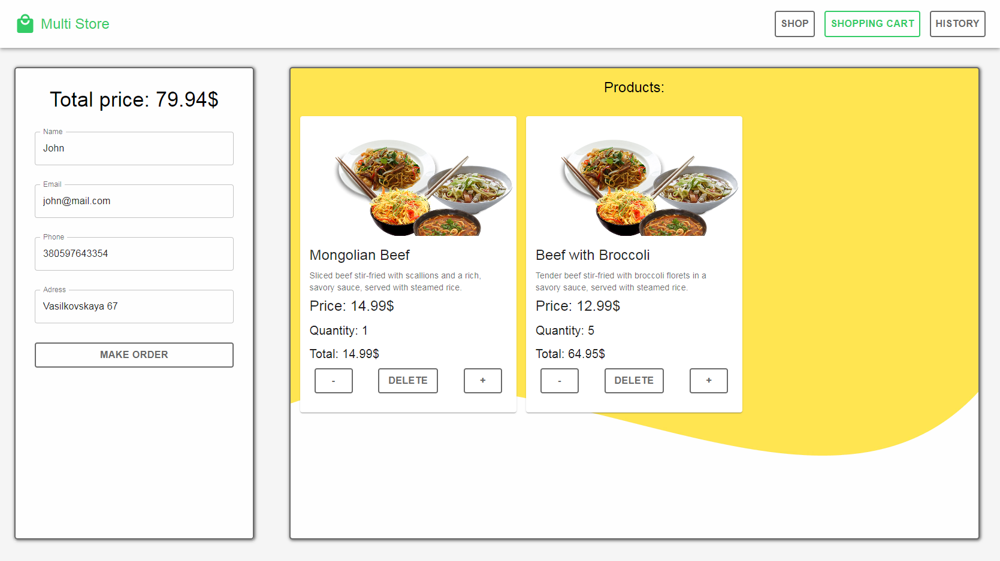
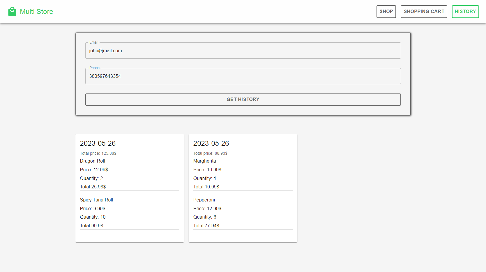

#Multi Store Frontend

### 👉 ❗❗ ATTENTION ❗❗

### The backend uses render.com, and the server goes to sleep after 15 minutes of user inactivity (no requests to the server). And when a new request comes in, the server restarts. But it takes 2-4 minutes.

### This repository contains a frontend application developed using React Typescript that uses its own [backend](https://github.com/GnatykOleg/multi-store-backend).

## Application Description:

Applications for ordering products from the possible options. Application with adaptive design for sizes 320px, 768px 1280px.

## Functionality:

### The application provides the following features:

- On the main page, the user can view the list of stores and select products (add to cart). A user can simultaneously place an order from 1 store. He cannot add an already existing item to the cart.

- On the shopping cart page, the user can view the added items. Change their quantities or delete them, and view additional information available only on the cart page. Place an order using the form.
  The basket is stored in local storage, the order is stored in the database after the order is placed, and the local storage is cleared.

- On the history page, the user can view the history of their orders by entering a phone number and email.

## Run instructions:

### Follow these steps to run the application:

- Make sure you have Node.js and npm (Node Package Manager) installed.
- Clone this repository on your local machine.
- Change to the root folder of the project.
- Install the dependencies by running npm install.
- Add the necessary environment variables to the .env file, an example of variables is contained in .env.sample.
- Run the application, run npm start. The list of available commands can be found in the package.json file
- The application will be launched and will be available at http://localhost:3000.

### Shop page

### Cart page

### History page

